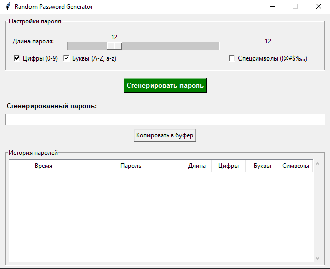
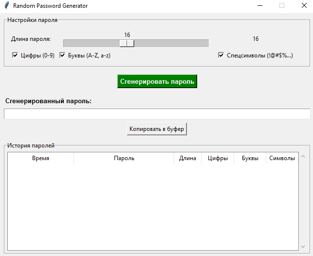
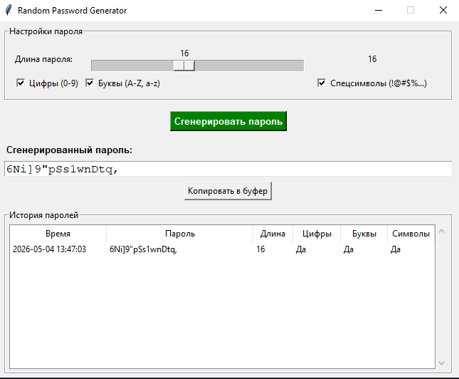
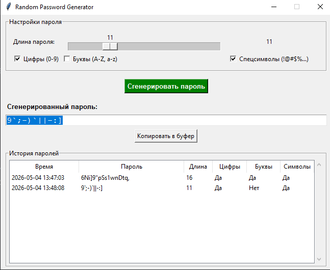
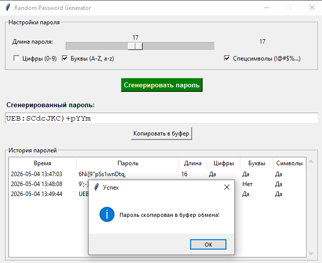
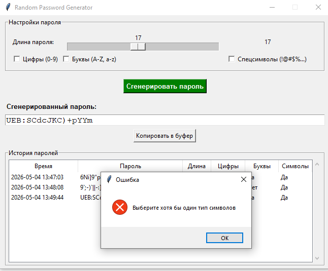
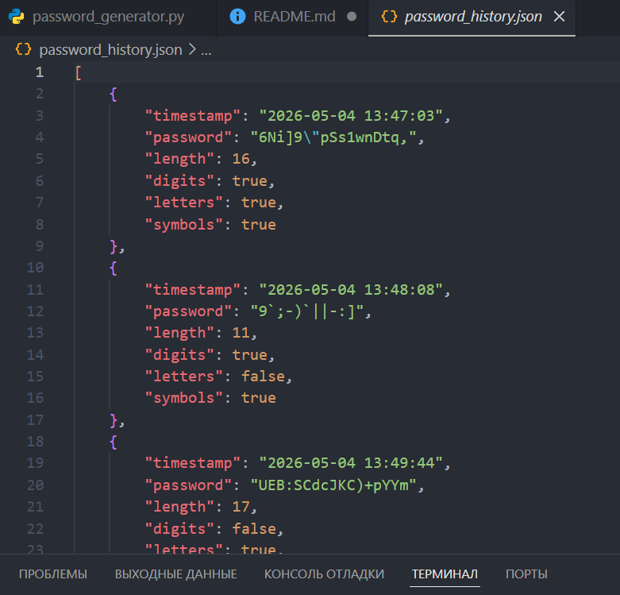
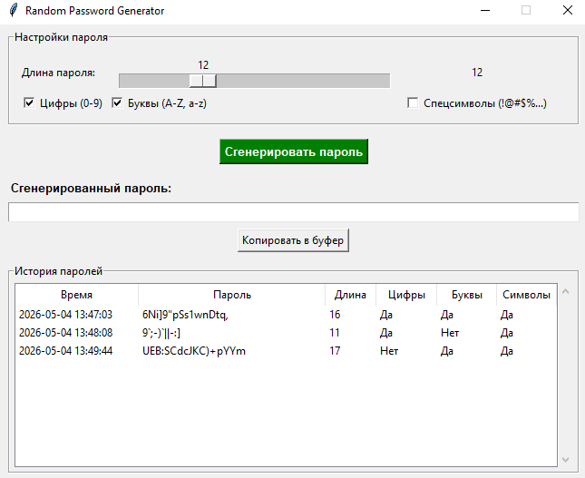
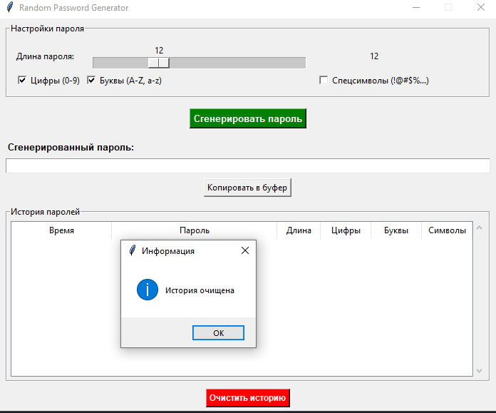

# Random Password Generator

**Автор:** Адзиев Мурад Магомедсаидович 
**Версия:** 1.0

## Описание проекта

Графическое приложение (GUI) для генерации случайных паролей с возможностью:
- Настройки длины пароля (4–32 символа)
- Выбора типов символов (цифры, буквы, спецсимволы)
- Сохранения истории всех сгенерированных паролей в JSON-файл
- Копирования пароля в буфер обмена
- Очистки истории

Приложение написано на Python с использованием библиотек `tkinter`, `random`, `json`.

---

## Скриншоты всех этапов работы

### 1. Главное окно приложения при запуске


**Что видно:** Ползунок длины пароля (по умолчанию 12), чекбоксы (цифры и буквы включены, спецсимволы выключены), пустое поле для пароля, пустая таблица истории.

---

### 2. Настройка параметров перед генерацией


**Действие:** Пользователь меняет длину на 16, включает спецсимволы.  
**Результат:** Чекбоксы все три отмечены, ползунок показывает 16.

---

### 3. Генерация первого пароля


**Действие:** Нажата кнопка "Сгенерировать пароль".  
**Результат:** В поле появился пароль, в таблицу истории добавилась первая запись с временем, паролем и параметрами.

---

### 4. Генерация второго пароля с другими настройками


**Действие:** Пользователь убрал спецсимволы, оставил только цифры и буквы, длина 8. Нажата генерация.  
**Результат:** Новый пароль отобразился в поле, в истории появилась вторая строка.

---

### 5. Копирование пароля в буфер обмена


**Действие:** Нажата кнопка "Копировать в буфер".  
**Результат:** Появилось всплывающее сообщение "Пароль скопирован в буфер обмена!".

---

### 6. Попытка генерации без выбора символов (обработка ошибки)


**Действие:** Пользователь снял все три чекбокса и нажал "Сгенерировать пароль".  
**Результат:** Появилось сообщение об ошибке "Выберите хотя бы один тип символов".

---

### 7. Структура JSON-файла


**Описание:** Структура JSON-файла.  

---

### 8. Закрытие приложения и проверка сохранения истории


**Действие:** Приложение закрыто и открыто снова.  
**Результат:** Таблица истории загрузила все сохранённые ранее записи из JSON-файла.

---

### 9. Очистка истории


**Действие:** Нажата кнопка "Очистить историю", подтверждено в диалоговом окне.  
**Результат:** Таблица истории стала пустой. JSON-файл `password_history.json` также очищен.

---

## Технические требования

- Python 3.6+
- Стандартные библиотеки (установка не требуется)

## Запуск

```bash
git clone https://github.com/AdzievMurad/password_generator.git
cd password_generator